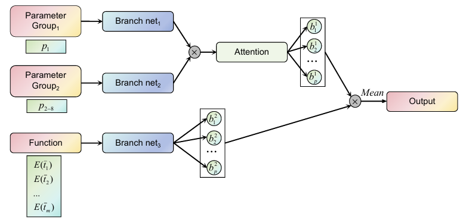

# ThermoONet_Comet: A Deep Learning Framework for Cometary Thermophysical Modeling and Parameter Inversion
ThermoONet is a PyTorch-based deep learning framework designed for cometary thermophysical modeling and parameter inversion. It uses a modified deep operator neural network architecture with channel attention mechanisms to model the thermal behavior of comet nuclei and estimate physical parameters from observational data.
## Features
* **Thermophysical Modeling**: Predicts subsurface temperature distributions and water production rates for cometary nuclei
* **Size Inversion**: Estimates nucleus size of comets using water production data from observations
* **Custom Architecture**: Implements channel attention mechanisms and branch networks for specialized feature processing
* **Multi-branch Design**: Processes different types of input parameters through specialized network branches
## Some key Physical Parameters
The model uses several physical parameters:
* Dust mantle thickness
* Icy area fraction
* Thermal conductivity of dust mantle and dust-ice mixture
* Density
* Specific heat capacity
* Spin angular velocity
* Spin orientation ...
## Overview
This repository contains three main components:
1. **ThermoONet Architecture**: The modified deep operator neural network architecture with channel attention mechanisms
2. **67P/Churyumov-Gerasimenko Benchmark**: Application of ThermoONet to model the thermal behavior of comet 67P
3. **Comet Size Inversion**: Implementation for estimating nucleus size of comet C/2002 Y1 (Juels-Holvorcem) through the water production rate provided by SOHO/SWAN observations
## Prerequisites
* Python 3.8+
* PyTorch (GPU version recommended)
* NumPy
* SciPy
* Matplotlib
* pandas
* plyfile ...
## GPU Support
For optimal performance, install the PyTorch version that matches your GPU capabilities. Please refer to the [PyTorch official website](https://pytorch.org/) for installation instructions specific to your hardware.
## Usage
### Data
This file contains train, test and validation dataset:
* train_dataset: the dataset used for training the network. After decompression, the data can be read using the following code format:
```python
data = []
folder_path = f'train_dataset/sigmoid4_0'
pkl_files = [f for f in os.listdir(folder_path) if f.endswith('.pkl')]
for file in pkl_files:
    with open(os.path.join(folder_path, file), 'rb') as f:
        data_mid = pickle.load(f)
        data_mid = [x for x in data_mid if x is not None]
        data.append(data_mid)
```
After combining all data, a batchsize*10 array can be obtained, representing the radiative flux function, subsurface temperature function, and 8 key physical parameters (corresponding to $p_1$-$p_8$ in the network card).
### 1. Neural Network Architecture ([ThermoONet_architecture.py](Network/ThermoONet_architecture.py))  
  
This file contains the core neural network architecture including:
* SELayer: Channel attention mechanism module
* Branch1, Branch2, Branch3: Specialized branch networks
* Branch: Main network that combines all branches
### 2. 67P Benchmark Testing ([Test_ThermoONet_67P.ipynb](Test_67P/Test_ThermoONet_67P.ipynb))
Applies ThermoONet to comet 67P/Churyumov-Gerasimenko:
```python
# Load pre-trained model
branch = torch.load("Network/network_accurate.pkl")

# Calculate water production rate
gd_sol, tem = water_production([3.61079546e-03, 6.44077065e-03, 4.66889659e-02, 4.69151339e-02, 8.94414100e+00])

# Plot results
plot_water_production(gd_sol)
plot_temperature_distribution(tem)
```
* Orbital data (solar_position.txt)
* Shape model (cg-spc-shap8-v2.0-cheops-003k.ply)
* Shadow data (shadow_67P_gai.pkl)
* Water production observations (laeuteretal_prod.csv)
### 3. Size Inversion for C/2002 Y1 ([Test_ThermoONet_2002Y1.ipynb](Test_size_2002Y1/Test_ThermoONet_2002Y1.ipynb))
Estimates nucleus size using SOHO/SWAN data and JPL data:
```python
# Initialize size calculator
tab_files1 = 'water_c_2002_y1_juels_hovorcem.tab'
tab_files2 = '2002_y1_juels_hovorcem.txt'
Size_cal = Size_inverse(tab_files1, tab_files2)

# Calculate size
size = Size_cal.cal()
print(f'Estimated nucleus size: {size}')
```
* Water production data (.tab files)
* Orbital data from JPL (.txt files)
## Applications
### For Known Comets (e.g., 67P)
1. Validation of thermophysical models
2. Comparison with observational data
3. Detailed study of activity patterns
### For Unknown Comets
1. Nucleus size estimation from water production data
2. Physical parameter optimization through inverse modeling
3. Comparative studies with large sample of comets
## Notes
1. The code requires GPU acceleration for efficient computation
2. File paths in the code need to be adjusted according to your local directory structure
3. For different comets, adjust the activity peak position in the Size_inverse class
4. The annealing algorithm runs 30 cycles by default for size inversion
## References
This implementation is based on deep-learning-driven thermophysical modeling for cometary activity ([Zhao et al., 2025](https://doi.org/10.1051/0004-6361/202554703)).
## License
This project is for research purposes. Please cite appropriate references if using this code in publications.
## Contact
For questions regarding this implementation, please open an issue in the GitHub repository.


